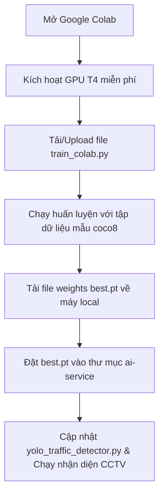

# Hướng dẫn Huấn luyện Mô hình YOLOv8 trên Google Colab cho CivicTwinAI

Tài liệu này hướng dẫn bạn cách huấn luyện mô hình YOLOv8 trên môi trường Google Colab để nhận diện các phương tiện giao thông (xe con, xe máy, xe bus, xe tải) từ CCTV, sau đó tải trọng số về chạy suy diễn (inference) cục bộ.

---

## 📅 Quy trình Huấn luyện & Triển khai



---

## 1. Chuẩn bị trên Google Colab

1. Truy cập vào trang web [Google Colab](https://colab.research.google.com/).
2. Chọn **New Notebook** (Sổ tay mới).
3. Đổi tên sổ tay thành `CivicTwin_YOLOv8_Training.ipynb`.

### Kích hoạt GPU (Quan trọng)
Để mô hình huấn luyện nhanh chóng (gấp 10-20 lần CPU), bạn cần sử dụng GPU miễn phí của Google Colab:
- Vào menu **Runtime** (Thời gian chạy) -> **Change runtime type** (Thay đổi loại thời gian chạy).
- Tại mục **Hardware accelerator** (Trình tăng tốc phần cứng), chọn **T4 GPU** (hoặc GPU bất kỳ khả dụng).
- Nhấn **Save** (Lưu).

---

## 2. Các bước Huấn luyện mô hình

Bạn có thể chọn 1 trong 2 cách sau để chạy huấn luyện trên Colab:

### Cách 1: Upload file `train_colab.py` (Khuyên dùng)
1. Nhìn vào menu bên trái của Google Colab, click vào biểu tượng **Thư mục** (Files).
2. Kéo thả file `train_colab.py` từ thư mục `ai-service/` trên máy tính của bạn vào bảng Files của Colab.
3. Tạo một cell mới trên Colab và chạy lệnh sau để bắt đầu huấn luyện:
   ```bash
   !python train_colab.py
   ```

### Cách 2: Chạy trực tiếp qua mã Cell trên Colab
Nếu bạn không muốn upload file, hãy copy đoạn mã sau vào một cell trên Colab và nhấn nút Play (chạy):

```python
# 1. Cài đặt thư viện Ultralytics YOLOv8
!pip install ultralytics

# 2. Import thư viện và kiểm tra GPU
import torch
from ultralytics import YOLO
print("CUDA Available:", torch.cuda.is_available())

# 3. Tải mô hình nền tảng (pre-trained) YOLOv8n
model = YOLO("yolov8n.pt")

# 4. Huấn luyện mô hình với tập dữ liệu mẫu coco8
# Tập dữ liệu coco8 tự động tải về và chứa các nhãn xe (car, motorcycle, bus, truck) phù hợp
results = model.train(
    data="coco8.yaml",
    epochs=50,             # Tăng lên 100-150 nếu có thời gian để đạt độ chính xác cao hơn
    imgsz=640,
    batch=16,
    device=0,              # Sử dụng GPU đầu tiên
    project="civictwin_yolo_colab",
    name="traffic_detector",
    save=True
)
```

---

## 3. Tải file trọng số (Weights) về máy

Sau khi huấn luyện thành công, kết quả sẽ được lưu tại thư mục đầu ra trên Colab.
1. Mở lại biểu tượng **Thư mục** (Files) ở thanh menu bên trái Colab.
2. Tìm đến đường dẫn: `civictwin_yolo_colab/traffic_detector/weights/`.
3. Bạn sẽ thấy file `best.pt` (Trọng số tốt nhất đạt được).
4. Click vào dấu 3 chấm cạnh file `best.pt` -> Chọn **Download** để tải về máy tính.

---

## 4. Cấu hình và chạy nhận diện CCTV cục bộ (Local)

Sau khi tải thành công file `best.pt` về máy của bạn:

1. Di chuyển file `best.pt` vào thư mục `ai-service/` của dự án `CivicTwinAI`.
2. Mở file [yolo_traffic_detector.py](file:///d:/Projects/AseanAI/CivicTwinAI/ai-service/yolo_traffic_detector.py) và cập nhật đường dẫn mô hình (Dòng 9):
   ```python
   MODEL_PATH = "best.pt"  # Thay vì yolov8n.pt mặc định
   ```
3. Đảm bảo bạn đã chuẩn bị một video giao thông mẫu tên là `traffic_video.mp4` đặt trong thư mục `ai-service/` (hoặc cấu hình đường dẫn tương ứng tại dòng 8 `VIDEO_PATH`).
4. Chạy script nhận diện phương tiện để kiểm thử:
   ```bash
   python yolo_traffic_detector.py
   ```

> [!TIP]
> Bạn có thể tăng số lượng `epochs` lên 100 hoặc 150 trong quá trình huấn luyện thực tế để mô hình học kỹ các đặc trưng hình ảnh của xe cộ từ camera CCTV góc cao, giúp giảm thiểu sai sót nhận diện khi trời tối hoặc mưa nghẽn.
